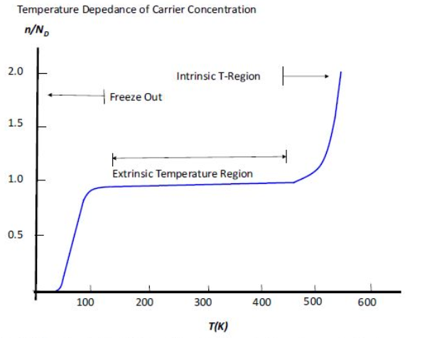
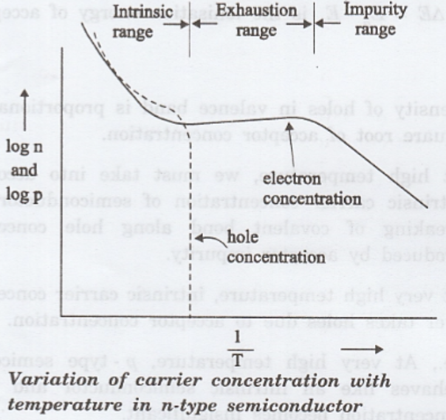

In semiconductors, the **carrier concentration** and the **position of energy levels** depend strongly on **temperature**, **doping concentration**, and **intrinsic material properties**.  
Understanding these variations is crucial for analyzing and designing semiconductor devices.

---

## **Temperature Dependence of Carrier Concentration**

In a semiconductor, the free carrier concentration changes significantly with temperature due to the **ionization of dopants** and the **generation of intrinsic carriers**.  
The variation can be divided into **three distinct regions**:

- **Freeze-out Region** → At low temperatures, donor or acceptor atoms are **not fully ionized**. Carrier concentration is **much smaller** than the doping level.
- **Extrinsic Region** → At moderate temperatures, **dopants are fully ionized** and carrier concentration remains nearly constant, determined by the **doping concentration**.
- **Intrinsic Region** → At high temperatures, **thermally generated intrinsic carriers dominate** over dopant-generated carriers.

The normalized carrier concentration \( n / N_D \) is approximately:

$$
\frac{n}{N_D} \approx
\begin{cases}
\text{small}, & \text{Freeze-out region} \\\\
1, & \text{Extrinsic region} \\\\
\frac{n_i}{N_D}, & \text{Intrinsic region}
\end{cases}
$$

where the **intrinsic carrier concentration** \( n_i \) is given by:

$$
n_i = \sqrt{N_C N_V} \; e^{-\frac{E_g}{2kT}}
$$

**Where:**
- \(N_C\) → Effective density of states in the conduction band  
- \(N_V\) → Effective density of states in the valence band  
- \(E_g\) → Bandgap energy  
- \(k\) → Boltzmann constant  
- \(T\) → Absolute temperature  

 

Energy band diagrams at different temperature ranges illustrate **electron excitation** from donor levels to the conduction band.

 

---

## **Position of Fermi Energy Levels with Respect to Doping**

The **Fermi level** \(E_F\) in a semiconductor indicates the **probability of occupancy** of electron states.  
Its position depends on the **doping type** and **concentration**.

### **For n-type Semiconductors**

In an **n-type semiconductor**, the Fermi level lies **closer to the conduction band** due to the higher concentration of electrons:

$$
E_F = E_C - kT \ln \left( \frac{N_C}{N_D} \right)
$$

**Where:**
- \(E_C\) → Conduction band edge energy  
- \(N_D\) → Donor concentration (assumed fully ionized)

---

### **For p-type Semiconductors**

For **p-type materials**, the Fermi level lies **closer to the valence band**:

$$
E_F = E_V + kT \ln \left( \frac{N_V}{N_A} \right)
$$

**Where:**
- \(E_V\) → Valence band edge energy  
- \(N_A\) → Acceptor concentration  

> **Note:** In **highly doped semiconductors**, the Fermi level may even lie **inside the conduction or valence band**, entering the **degenerate regime**.

 
---

## **Equilibrium Concentration Relationships**

In thermal equilibrium, the electron and hole concentrations in a semiconductor obey the **mass action law**:

$$
n_0 \, p_0 = n_i^2
$$

**Where:**
- \(n_0\) → Equilibrium electron concentration  
- \(p_0\) → Equilibrium hole concentration  
- \(n_i\) → Intrinsic carrier concentration  

---

### **Charge Neutrality Condition**

For **n-type semiconductors**:

$$
n_0 + N_A^- = p_0 + N_D^+
$$

For **p-type semiconductors**:

$$
p_0 + N_D^+ = n_0 + N_A^-
$$

Where \(N_A^-\) and \(N_D^+\) are the **ionized acceptor** and **donor concentrations**, respectively.

---

### **Carrier Concentrations in Doped Semiconductors**

For **non-degenerate, fully ionized doping**:

#### **n-type semiconductor:**

$$
n_0 \approx N_D, \qquad p_0 = \frac{n_i^2}{N_D}
$$

#### **p-type semiconductor:**

$$
p_0 \approx N_A, \qquad n_0 = \frac{n_i^2}{N_A}
$$

---

These relationships are **fundamental** in analyzing **semiconductor behavior under equilibrium** and form the basis for understanding **carrier transport under non-equilibrium conditions**.
